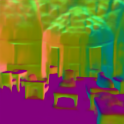
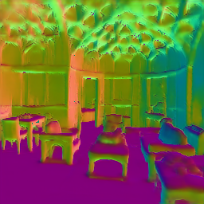
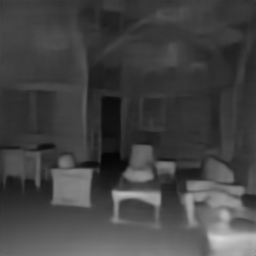
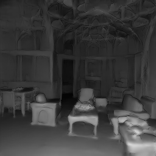
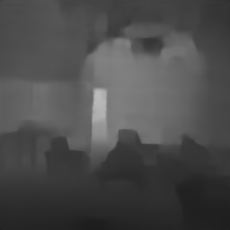
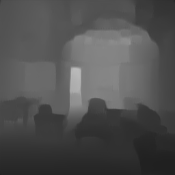
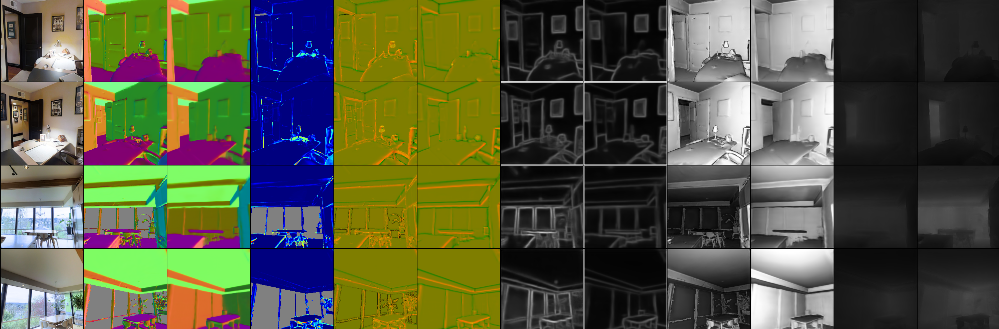

# [Repo under construction!] Robust Learning Through Cross-Task Consistency

Visual perception entails solving a wide set of tasks (e.g. object detection, depth estimation, etc). The predictions made for each task out of a particular observation are not independent, and therefore, are expected to be **consistent**.


*A comparison of the results from consistency-based learning and learning each task individually. The yellow markers highlights the improvement in fine grained details.*


**What is consistency?** Given that the underlying scene is the same, different tasks predictions should be consistent eg. the depth of one region should not be flat if normals are uneven.

**Why is it important?** Inconsistencies imply contradictions, which casts doubts on the validity of predictions for downstream uses. Furthermore, they can be used to better fit the data and reduce sample complexity required. It may also reduce the tendency of neural networks to learn superficial cues by enforcing constraints rooted in different geometric or physical aspects of one observation.

**How do we enforce it?** The underlying concept is that of path independence in a network of tasks. Given an endpoint `X3`, the path from 
`X1->X2->X3` should give the same results as `X1->X3`. This can be generalized to a larger system, with paths of arbitrary lengths. In this case, the nodes of the graph are our prediction domains (eg. depth, normal) and the edges are neural networks mapping these domains.


This repository includes [training](#training) code for enforcing cross task consistency, [demo](#run-demo-script) code for visualizing results of a consistency trained model on a given image and [links](#download-consistency-trained-networks) to download these models. For further details, refer to our [paper]() or [website](https://consistency.epfl.ch/).

#### Alternatively, upload your own image to compare the results or explore other visiualizations below
| [Upload here](https://consistency.epfl.ch/demo/) | [Visualizations](https://consistency.epfl.ch/visuals/) 
|:----:|:----:|
| [](https://consistency.epfl.ch/demo/) | [](https://consistency.epfl.ch/visuals/) |

Table of contents
=================

   * [Introduction](#introduction)
   * [Installation](#install-requirements)
   * [Run the demo code](#run-demo-script)
   * [Train a consistency model](#training)
     * [Code structure](#the-code-is-structured-as-follows)
     * [Instructions for training with the configuration as in the paper](#steps)
     * [For Other configurations](#to-train-on-other-target-domains)
   * [Energy computation](#energy-computation)
   * [Citing](#citation)


## Introduction 


#### Dataset

The following domains from the [Taskonomy dataset](https://github.com/StanfordVL/taskonomy/tree/master/data) were used to train the model. Domains with (\*) are used as a target domain with all others being used for the perceptual losses ie. a `depth` target would have `curvature`, `edge2d`, `edge3d`, `keypoint2d`, `keypoint3d`, `reshading`, `normal` as perceptual losses.

```
Curvature         Depth*                Edge-3D        
Edge-2D           Keypoint-2D           Keypoint-3D     
Reshading*        Surface-Normal*       RGB
```

Descriptions for each domain can be found in the [supplementary file](http://taskonomy.stanford.edu/taskonomy_supp_CVPR2018.pdf) of Taskonomy.

#### Network Architecture

The networks are based on the [UNet](https://arxiv.org/pdf/1505.04597.pdf) architecture. They take in an input size of 256x256, upsampling is done via bilinear interpolations instead of deconvolutions and trained with the L1 loss. See the table below for more information.

| Task Name | Output Dimension | Downsample Blocks |
|-----------|------------------|-------------------|
| depth     | 256x256x1        | 6                 |
| reshading | 256x256x1        | 5                 |
| normal    | 256x256x3        | 6                 |

## Install requirements
See `requirements.txt` for complete list of packages. We recommend doing a clean installation of requirements using virtualenv:

```
conda create -n testenv python=3.6
source activate testenv
pip install -r requirements.txt
```

## Run demo script

#### Clone the code from github

```
git clone https://github.com/amir32002/scaling.git
cd scaling
git checkout ch_release
```

#### Download consistency trained networks
The pretrained models for the demo can be downloaded with the following command.

```
sh ./tools/download_models.sh
```

This downloads the `baseline`, `consistency` trained models for `depth`, `normal` and `reshading` target (1.3GB). They will be saved to a folder called `models`.

Individial models can be downloaded [here](https://drive.switch.ch/index.php/s/QPvImzbbdjBKI5P).

#### Running single image tasks

To run the trained model of a task on a specific image:

```
python demo.py --task $TASK --img_path $PATH_TO_IMAGE_OR_FOLDER --output_path $PATH_TO_SAVE_OUTPUT
```

The `--task` flag specifies the target task for the input image, which should be either `normal`, `depth` or `reshading`.

To run the script for a `normal` target on the [example image](./assets/test.png):

```
python demo.py --task normal --img_path assets/test.png --output_path assets/
```

It returns the output prediction from the baseline (`test_normal_baseline.png`) and consistency models (`test_normal_consistency.png`).

Test image                 |  Baseline			|  Consistency
:-------------------------:|:-------------------------: |:-------------------------:
|   |  


Similarly, running for target tasks `reshading` and `depth` gives the following.

  Baseline (reshading)      |  Consistency (reshading)   |  Baseline (depth)	       |  Consistency (depth)
:-------------------------: |:-------------------------: | :-------------------------: |:-------------------------:
 |   |  |  


## Training

#### Download perceptual networks

The pretrained perceptual models can be downloaded with the following command.

```
sh ./tools/download_percep_models.sh
```

This downloads the perceptual models for the `depth`, `normal` and `reshading` target (1.6GB). Each target has 7 pretrained models. They should be placed in the file path defined by `MODELS_DIR` in `utils.py`.

Individual models can be downloaded [here](https://drive.switch.ch/index.php/s/aXu4EFaznqtNzsE).

#### The code is structured as follows

```python
config/  
    split.txt             	# Train, val split
    jobinfo.txt			# Defines job name, base_dir
modules/          		# Network definitions
train.py			# Training script
dataset.py			# Creates dataloader
energy.py			# Defines path config, computes total loss, logging
models.py			# Implements forward backward pass
graph.py			# Computes path defined in energy.py
task_configs.py			# Defines task specific preprocessing, masks, loss fn
transfers.py			# Loads models
utils.py			# Defines file paths (described below) 
demo.py             		# Demo script
```

#### Default folder structure
```python
base_dir/  		            # The following paths are defined in utils.py (BASE_DIR)
    shared/			    # with the corresponding variable names in brackets
        models/			    # Pretrained models (MODELS_DIR)
        results_[jobname]/	    # Checkpoint of model being trained (RESULTS_DIR)
        ood_standard_set/	    # OOD data for visualization (OOD_DIR)
    data_dir/			    # taskonomy data (DATA_DIRS)
```

#### Steps

1) Create a `jobinfo.txt` file and define the name of the job and the absolute path to `BASE_DIR` where data, models results would be stored, as shown in the folder structure above. An example config would be,

   ```
   normaltarget_allperceps, /scratch
   ```

   To modify individual file paths eg. the models folder, change `MODELS_DIR` variable name in `utils.py`.

2) Train the task-specific network with the command

   ```
   python -m train multiperceptual_{depth,normal,reshading}
   ```

   To run the training code for the `normal` target, run 

   ```
   python -m train multiperceptual_normal
   ```

   This trains the model for the `normal` target with 8 perceptual losses ie. `curvature`, `edge2d`, `edge3d`, `keypoint2d`, `keypoint3d`, `reshading`, `depth` and `imagenet`. We used 3 V100 (32GB) GPUs to train our models, running them for 500 epochs takes about a week.

   Additional arugments can be specified during training, the most commonly used ones are listed below. For the full list, refer to the [training script](./train.py). 
   - The flag `--k` defines the number of perceptual losses used, thus reducing GPU memory requirements.
   - There are several options for choosing how this subset is chosen 1. randomly (`--random-select`) 2. winrate (`--winrate`) 3. gradnorm (default). 
   - Data augmentation is not done by default, it can be added to the training data with the flag `--dataaug`. The transformations applied are 1. random crop with probability 0.5 2. [color jitter](https://pytorch.org/docs/stable/torchvision/transforms.html?highlight=color%20jitter#torchvision.transforms.ColorJitter) with probability 0.5.

   To train a `normal` target domain with 2 perceptual losses selected randomly each epoch, run the following command.

   ```
   python -m train multiperceptual_normal --k 2 --random-select
   ```

   The full list of options can be found in the `train.py` file.

3) The losses and visualizations are logged in Visdom. This can be accessed via `[server name]/env/[job name]` eg. `localhost:8888/env/normaltarget_allperceps`. 

   An example visualization is shown below. We plot the the outputs from the paths defined in the energy configuration used. Two windows are shown, one shows the predictions before training starts, the other updates them after each epoch. The labels for each column can be found at the top of the window. The second column has the target's ground truth `y^`, the third its prediction `n(x)` from the RGB image `x`. Thereafter, the predictions of each pair of images with the same domain are given by the paths `f(y^),f(n(x))`, where `f` is from the target domain to another domain eg. `curvature`.



#### To train on other target domains
1. A new configuration has to be defined in the `energy_configs` dictionary in `energy.py`. 

   A brief decription of the infomation needed:
   - `paths`: `X1->X2->X3`. The keys in this dictionary uses a function notation eg. `f(n(x))`, with its corresponding value being a list of task objects that defines the domains being transfered eg. `[rgb, normal, curvature]`. The `rgb` input is defined as `x`, `n(x)` returns `normal` predictions from `rgb`, and `f(n(x))` returns `curvature` from `normal`. These notations do not need to be same for all configurations. The [table](#function-definitions) below lists those that have been kept constant for all targets.
   - `freeze_list`: the models that will not be optimized,
   - `losses`: loss terms to be constructed from the paths defined above,
   - `plots`: the paths to plots in the visdom environment.

2. New models may need be defined in the `pretrained_transfers` dictionary in `transfers.py`. For example, for a `curvature` target, and perceptual model `curvature` to `normal`, the code will look for the `principal_curvature2normal.pth` file in `MODELS_DIR` if it is not defined in `transfers.py`.

##### Function definitions
The RGB input is defined as `x`, ground truth as `y^`. 

| rgb2Z | target2Z | Z           | rgb2Z | target2Z | Z              |
|-------|----------|-------------|-------|----------|----------------|
| n     | -        | target      | k2    | Nk2      | keypoints2d    |
| RC    | f        | curvature   | k3    | Nk3      | keypoints3d    |
| a     | s        | sobel edges | E0    | nE0      | edge occlusion |

The functions in columns **rgb2Z** and **target2Z** correspond to the output defined column **Z** ie. the function for `rgb` to `curvature` is `RC`, for target to `curvature` its `f`.


## Energy computation
Coming soon


## Citation
If you find the code, models, or data useful, please cite this paper:

```
[add ref]
```
