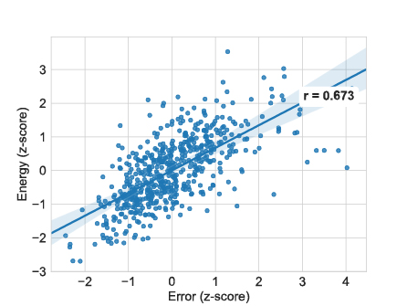

# Robust Learning Through Cross-Task Consistency <br>[Repo under construction!] 

[](https://consistency.epfl.ch)

<table>
      <tr><td><em>Above: A comparison of the results from consistency-based learning and learning each task individually. The yellow markers highlight the improvement in fine grained details.</em></td></tr>
</table>

<br>
This repository contains tools for training and evaluating models using consistency:

- [Pretrained models](#download-consistency-trained-networks)
- [Demo code](#run-demo-script) and an [online live demo](https://consistency.epfl.ch/demo/)
- [_Uncertainty energy_ estimation code](#Energy-computation)
- [Training scripts](#training)
- [Docker and installation instructions](#training)

for the following paper:<br><a href=https://consistency.epfl.ch>Robust Learing Through Cross-Task Consistency</a> (CVPR 2020, Oral).<br>
Amir Zamir, Alexander Sax, Teresa Yeo, Oğuzhan Kar, Nikhil Cheerla, Rohan Suri, Zhangjie Cao, Jitendra Malik, Leonidas Guibas 

<!-- <div style="text-align:center">
<h4><a href=https://consistency.epfl.ch>Robust Learing Through Cross-Task Consistency</a> (CVPR 2020, Oral)</h4>
Amir Zamir, Alexander Sax, Teresa Yeo, Oğuzhan Kar, Nikhil Cheerla, Rohan Suri, Zhangjie Cao, Jitendra Malik, Leonidas Guibas 
</div>
<br> -->

For further details, a [live demo](https://consistency.epfl.ch/demo/), and [video evaluations](https://consistency.epfl.ch/visuals/), refer to our [project website](https://consistency.epfl.ch/).

#### PROJECT WEBSITE:
<div style="text-align:center">

| [LIVE DEMO](https://consistency.epfl.ch/demo/) | [VIDEO EVALUATION](https://consistency.epfl.ch/visuals/) 
|:----:|:----:|
| Upload your own images and see the results of different consistency-based models vs. various baselines.<br><br>[](https://consistency.epfl.ch/demo/) | Visualize models with and without consistency, evaluated on a (non-cherry picked) YouTube video.<br><br><br>[](https://consistency.epfl.ch/visuals/) |

</div>

---

Table of contents
=================

   * [Introduction](#introduction)
   * [Installation](#installation)
   * [Quickstart (demo code)](#quickstart-(run-demo-locally))
   * [Energy computation](#energy-computation)
   * [Download all pretrained models](pretrained-models)
   * [Train a consistency model](#training)
     * [Instructions for training](#steps)
     * [To train on other configurations](#to-train-on-other-target-domains)
   * [Citing](#citation)

<br>

## Introduction 

Visual perception entails solving a wide set of tasks (e.g. object detection, depth estimation, etc). The predictions made for each task out of a particular observation are not independent, and therefore, are expected to be **consistent**.

**What is consistency?** Given that the underlying scene is the same, different tasks predictions should be consistent eg. the depth of one region should not be flat if normals are uneven.

**Why is it important?** Inconsistencies imply contradictions, which casts doubts on the validity of predictions for downstream uses. Furthermore, they can be used to better fit the data and reduce sample complexity required. It may also reduce the tendency of neural networks to learn superficial cues by enforcing constraints rooted in different geometric or physical aspects of one observation.

**How do we enforce it?** The underlying concept is that of path independence in a network of tasks. Given an endpoint `X3`, the path from 
`X1->X2->X3` should give the same results as `X1->X3`. This can be generalized to a larger system, with paths of arbitrary lengths. In this case, the nodes of the graph are our prediction domains (eg. depth, normal) and the edges are neural networks mapping these domains.

This repository includes [training](#training) code for enforcing cross task consistency, [demo](#run-demo-script) code for visualizing the results of a consistency trained model on a given image and [links](#pretrained-models) to download these models. For further details, refer to our [paper]() or [website](https://consistency.epfl.ch/).


#### Consistency Domains

Consistency constraints can be used for virtually any set of domains. This repository considers transferring between image domains, and our networks were trained for transferring between the following domains from the [Taskonomy dataset](https://github.com/StanfordVL/taskonomy/tree/master/data).
```
Curvature         Edge-3D            Reshading
Depth-ZBuffer     Keypoint-2D        RGB       
Edge-2D           Keypoint-3D        Surface-Normal 
```
Descriptions for each domain can be found in the [supplementary file](http://taskonomy.stanford.edu/taskonomy_supp_CVPR2018.pdf) of Taskonomy.

The repo contains consistency-trained models for the following transfers (the remaining 7 domains are used as consistency constraints in each transfer):
```
RGB -> Surface-Normals
RGB -> Depth-ZBuffer
RGB -> Reshading
```

#### Network Architecture

All networks are based on the [UNet](https://arxiv.org/pdf/1505.04597.pdf) architecture. They take in an input size of 256x256, upsampling is done via bilinear interpolations instead of deconvolutions and trained with the L1 loss. See the table below for more information.

|        Task Name        | Output Dimension | Downsample Blocks |
|-------------------------|------------------|-------------------|
| `RGB -> Depth-ZBuffer`  | 256x256x1        | 6                 |
| `RGB -> Reshading`      | 256x256x1        | 5                 |
| `RGB -> Surface-Normal` | 256x256x3        | 6                 |

Other networks (e.g. `Curvature -> Surface-Normal`) use a UNet, their architecture hyperparameters are detailed in [transfers.py](./transfers.py).

More information on the models, including download links, can be found [here](#pretrained-models) and in the [supplementary material](https://consistency.epfl.ch/supplementary_material).

<br>
<br>

## Installation

There are two convenient ways to run the code. Either using Docker (recommended) or using a Python-specific tool such as pip, conda, or virtualenv.

#### Installation via Docker [Recommended]

We provide a docker that contains the code and all the necessary libraries. It's simple to install and run. Simply run:
```
docker pull EPFLVL/xtc:latest
```

#### Installation via Pip/Conda/Virtualenv
The code can also be run using a Python environment manager such as Conda. See [requirements.txt](./requirements.txt) for complete list of packages. We recommend doing a clean installation of requirements using virtualenv:
1.  Clone the repo:
```
git clone https://github.com/amir32002/scaling.git
cd scaling
git checkout ch_release
```

2. Create a new environment and install the libraries:
```
conda create -n testenv python=3.6
source activate testenv
pip install -r requirements.txt
```


<br>
<br>

## Quickstart (Run Demo Locally)

#### Download the consistency trained networks
If you haven't yet, then download the [pretrained models](#Download-consistency-trained-models). Models used for the demo can be downloaded with the following command:
```
sh ./tools/download_models.sh
```

This downloads the `baseline`, `consistency` trained models for `depth`, `normal` and `reshading` target (1.3GB) to a folder called `./models/`. Individial models can be downloaded [here](https://drive.switch.ch/index.php/s/QPvImzbbdjBKI5P).

#### Run a model on your own image

To run the trained model of a task on a specific image:

```
python demo.py --task $TASK --img_path $PATH_TO_IMAGE_OR_FOLDER --output_path $PATH_TO_SAVE_OUTPUT
```

The `--task` flag specifies the target task for the input image, which should be either `normal`, `depth` or `reshading`.

To run the script for a `normal` target on the [example image](./assets/test.png):

```
python demo.py --task normal --img_path assets/test.png --output_path assets/
```

It returns the output prediction from the baseline (`test_normal_baseline.png`) and consistency models (`test_normal_consistency.png`).

Test image                 |  Baseline			|  Consistency
:-------------------------:|:-------------------------: |:-------------------------:
|   |  


Similarly, running for target tasks `reshading` and `depth` gives the following.

  Baseline (reshading)      |  Consistency (reshading)   |  Baseline (depth)	       |  Consistency (depth)
:-------------------------: |:-------------------------: | :-------------------------: |:-------------------------:
 |   |  |  


<br>
<br>

## Energy Computation

Training with consistency involves several paths that each predict the target domain, but using different cues to do so. The disagreement between these predictions yields an unsupervised quantity, _consistency cnergy_, that our CVPR 2020 paper found correlates with prediciton error. You can view the pixel-wise _consistency energy_ using our [live demo](https://consistency.epfl.ch/demo/).


To compute energy locally, over many images, and/or to plot energy vs error, you can use the following `energy_calc.py` script. The following command generates a scatter plot of _consistency energy_ vs. prediction error:

```
python -m scripts.energy_calc energy_calc --batch_size BATCH_SIZE --mode standard --subset_size=NUMBER_OF_IMAGES  --cont=PATH_TO_MODELS --use-l1=True --save_dir=RESULTS_DIR
```

|             Energy vs. Error             |
|:----------------------------------------:|
|         |
| _Result from running the above command._ | 

By default, it computes the energy and error of the `subset_size` number of points on the Taskonomy buildings `almena` and `albertville`. The error is computed for the `normal` target. The resulting plot is saved to `energy.pdf` in `RESULTS_DIR` and the corresponding data to `data.csv`. 

#### Compute energy on arbitrary images
_Consistency energy_ is an unsupervised quantity and as such, no ground-truth labels are necessary. To compute the energy for all query images in a directory, run:

```
python -m scripts.energy_calc energy_calc_nogt --data-dir=PATH_TO_QUERY_IMAGE --batch_size 1 --mode standard --subset_size=NUMBER_OF_IMAGES  --cont=PATH_TO_TRAINED_MODEL --use-l1=True --save_dir=RESULTS_DIR
```

It will append a dashed horizontal line to the plot above where the energy of the query image(s) are. This plot is saved to `energy.pdf` in `RESULTS_DIR`.


<br>
<br>

## Pretrained Models

We are providing all of our pretrained models for download. These models are the same ones used in the [live demo](https://consistency.epfl.ch/demo/) and [video evaluations](https://consistency.epfl.ch/visuals/).


#### Network Architecture
All networks are based on the [UNet](https://arxiv.org/pdf/1505.04597.pdf) architecture. They take in an input size of 256x256, upsampling is done via bilinear interpolations instead of deconvolutions. All models were trained with the L1 loss.


#### Download consistency-trained models
Instructions for downloading the trained consistency models can be found [here](#download-consistency-trained-networks)
```
sh ./tools/download_models.sh
```

This downloads the `baseline`, `consistency` trained models for `depth`, `normal` and `reshading` target (1.3GB) to a folder called `./models/`. See the table below for specifics:

|        Task Name        | Output Dimension | Downsample Blocks |
|-------------------------|------------------|-------------------|
| `RGB -> Depth-ZBuffer`  | 256x256x1        | 6                 |
| `RGB -> Reshading`      | 256x256x1        | 5                 |
| `RGB -> Surface-Normal` | 256x256x3        | 6                 |

Individual consistency models can be downloaded [here](https://drive.switch.ch/index.php/s/QPvImzbbdjBKI5P).


#### Download perceptual networks
The pretrained perceptual models can be downloaded with the following command.

```
sh ./tools/download_percep_models.sh
```

This downloads the perceptual models for the `depth`, `normal` and `reshading` target (1.6GB). Each target has 7 pretrained models (from the other sources below).

```
Curvature         Edge-3D            Reshading
Depth-ZBuffer     Keypoint-2D        RGB       
Edge-2D           Keypoint-3D        Surface-Normal 
```

Perceptual model architectural hyperparameters are detailed in [transfers.py](./transfers.py), and some of the pretrained models were trained using L2 loss. For using these models with the provided training code, the pretrained models should be placed in the file path defined by `MODELS_DIR` in [utils.py](./utils.py#L25).

Individual perceptual models can be downloaded [here](https://drive.switch.ch/index.php/s/aXu4EFaznqtNzsE).


#### Download baselines
We also provide the models for other baselines used in the paper, namely, those from [Taskonomy](https://arxiv.org/pdf/1804.08328.pdf), [GeoNet](https://ieeexplore.ieee.org/stamp/stamp.jsp?tp=&arnumber=8578135_) and a multitask model that we trained. They can be found [here](https://drive.switch.ch/index.php/s/gdom4FpiiYo1Qay). Note that we will not be providing support for them. 


<br>
<br>

## Training

#### Download the perceptual networks

The [pretrained perceptual models](#Download-perceptual-networks) can be downloaded with the following command.

```
sh ./tools/download_percep_models.sh
```

This downloads the perceptual models for the `depth`, `normal` and `reshading` target (1.6GB). Each target has 7 pretrained models. They should be placed in the file path defined by `MODELS_DIR` in [utils.py](./utils.py#L25).

Individual models can be downloaded [here](https://drive.switch.ch/index.php/s/aXu4EFaznqtNzsE).

#### The code is structured as follows

```python
config/  
    split.txt             	# Train, val split
    jobinfo.txt			# Defines job name, base_dir
modules/          		# Network definitions
train.py			# Training script
dataset.py			# Creates dataloader
energy.py			# Defines path config, computes total loss, logging
models.py			# Implements forward backward pass
graph.py			# Computes path defined in energy.py
task_configs.py			# Defines task specific preprocessing, masks, loss fn
transfers.py			# Loads models
utils.py			# Defines file paths (described below) 
demo.py             		# Demo script
```

#### Default folder structure
```python
base_dir/  		            # The following paths are defined in utils.py (BASE_DIR)
    shared/			    # with the corresponding variable names in brackets
        models/			    # Pretrained models (MODELS_DIR)
        results_[jobname]/	    # Checkpoint of model being trained (RESULTS_DIR)
        ood_standard_set/	    # OOD data for visualization (OOD_DIR)
    data_dir/			    # taskonomy data (DATA_DIRS)
```

#### Steps

1) Create a `jobinfo.txt` file and define the name of the job and the absolute path to `BASE_DIR` where data, models results would be stored, as shown in the folder structure above. An example config would be,

   ```
   normaltarget_allperceps, /scratch
   ```

   To modify individual file paths eg. the models folder, change `MODELS_DIR` variable name in [utils.py](./utils.py#L25).

2) Train the task-specific network with the command

   ```
   python -m train multiperceptual_{depth,normal,reshading}
   ```

   To run the training code for the `normal` target, run 

   ```
   python -m train multiperceptual_normal
   ```

   This trains the model for the `normal` target with 8 perceptual losses ie. `curvature`, `edge2d`, `edge3d`, `keypoint2d`, `keypoint3d`, `reshading`, `depth` and `imagenet`. We used 3 V100 (32GB) GPUs to train our models, running them for 500 epochs takes about a week.

   Additional arugments can be specified during training, the most commonly used ones are listed below. For the full list, refer to the [training script](./train.py).
   - The flag `--k` defines the number of perceptual losses used, thus reducing GPU memory requirements.
   - There are several options for choosing how this subset is chosen 1. randomly (`--random-select`) 2. winrate (`--winrate`)
   - Data augmentation is not done by default, it can be added to the training data with the flag `--dataaug`. The transformations applied are 1. random crop with probability 0.5 2. [color jitter](https://pytorch.org/docs/stable/torchvision/transforms.html?highlight=color%20jitter#torchvision.transforms.ColorJitter) with probability 0.5.

   To train a `normal` target domain with 2 perceptual losses selected randomly each epoch, run the following command.

   ```
   python -m train multiperceptual_normal --k 2 --random-select
   ```


3) The losses and visualizations are logged in Visdom. This can be accessed via `[server name]/env/[job name]` eg. `localhost:8888/env/normaltarget_allperceps`. 

   An example visualization is shown below. We plot the the outputs from the paths defined in the energy configuration used. Two windows are shown, one shows the predictions before training starts, the other updates them after each epoch. The labels for each column can be found at the top of the window. The second column has the target's ground truth `y^`, the third its prediction `n(x)` from the RGB image `x`. Thereafter, the predictions of each pair of images with the same domain are given by the paths `f(y^),f(n(x))`, where `f` is from the target domain to another domain eg. `curvature`.


#### To train on other target domains
1. A new configuration should be defined in the `energy_configs` dictionary in [energy.py](./energy.py#L39-L521). 

   Decription of the infomation needed:
   - `paths`: `X1->X2->X3`. The keys in this dictionary uses a function notation eg. `f(n(x))`, with its corresponding value being a list of task objects that defines the domains being transfered eg. `[rgb, normal, curvature]`. The `rgb` input is defined as `x`, `n(x)` returns `normal` predictions from `rgb`, and `f(n(x))` returns `curvature` from `normal`. These notations do not need to be same for all configurations. The [table](#function-definitions) below lists those that have been kept constant for all targets.
   - `freeze_list`: the models that will not be optimized,
   - `losses`: loss terms to be constructed from the paths defined above,
   - `plots`: the paths to plots in the visdom environment.

2. New models may need to be defined in the `pretrained_transfers` dictionary in [transfers.py](./transfers.py#L26-L97). For example, for a `curvature` target, and perceptual model `curvature` to `normal`, the code will look for the `principal_curvature2normal.pth` file in `MODELS_DIR` if it is not defined in [transfers.py](./transfers.py#L26-L97).

##### Function definitions
The RGB input is defined as `x`, ground truth as `y^`. 

| rgb2Z | target2Z | Z           | rgb2Z | target2Z | Z              |
|-------|----------|-------------|-------|----------|----------------|
| n     | -        | target      | k2    | Nk2      | keypoints2d    |
| RC    | f        | curvature   | k3    | Nk3      | keypoints3d    |
| a     | s        | sobel edges | E0    | nE0      | edge occlusion |

The functions in columns **rgb2Z** and **target2Z** correspond to the output defined column **Z** ie. the function for `rgb` to `curvature` is `RC`, for target to `curvature` its `f`.

#### To train on other datasets
The expected folder structure for the data is,
```
DATA_DIRS/
  [building]_[domain]/
      [domain]/
          [view]_domain_[domain].png
          ...
```
Pytorch's dataloader _\_\_getitem\_\__ method has been overwritten to return a tuple of all tasks for a given building and view point. This is done in [datasets.py](./datasets.py#L181-L198). Thus, for other folder structures, a function to get the corresponding file paths for different domains should be defined. 

For task specific configs, like transformations and masks, are defined in [task_configs.py](./task_configs.py#L341-L373).

<br>
<br>

## Citation
If you find the code, models, or data useful, please cite this paper:

```
@article{zamir2020consistency,
  title={Robust Learning Through Cross-Task Consistency},
  author={Zamir*, Amir R and Sax*, Alexander and Yeo, Teresa and Kar, Oğuzhan and Cheerla, Nikhil and Suri, Rohan and Cao, Zhangjie and Malik, Jitendra and Guibas, Leonidas},
}
```

