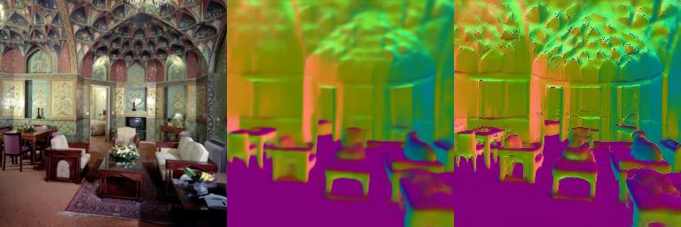

# [Repo under construction!] Consistency code

This folder contains the code used in the paper.

#### Dataset

The following domains from the [Taskonomy dataset](https://github.com/StanfordVL/taskonomy/tree/master/data) were used to train the model.

```
Curvature         Depth*                Edge-3D        
Edge-2D           Keypoint-2D           Keypoint-3D     
Reshading*        Surface-Normal*       RGB
```

#### Code structure

```python
config/  
    split.txt             	# Train, val split
    jobinfo.txt			# Defines job name, base_dir
modules/          		# Network definitions
train.py			# Training script
dataset.py			# Creates dataloader
energy.py			# Defines path config, computes total loss, logging
models.py			# Implements forward backward pass
graph.py			# Computes path defined in energy.py
task_configs.py			# Defines task specific preprocessing, masks, loss fn
transfers.py			# Loads models
utils.py			# Defines file paths (described below) 
demo.py             		# Demo script
```

#### Default folder structure
```python
base_dir/  		            # The following paths are defined in utils.py (BASE_DIR)
    shared/			    # with the corresponding variable names in brackets
        models/			    # Pretrained models (MODELS_DIR)
        results_[jobname]/	    # Checkpoint of model being trained (RESULTS_DIR)
        ood_standard_set/	    # OOD data for visualization (OOD_DIR)
data_dir/			    # taskonomy data (DATA_DIRS)
```

#### Install requirements
See `requirements.txt` for complete list of packages. We recommend doing a clean installation of requirements using virtualenv:

```
conda create -n testenv python=3.6
source activate testenv
pip install -r requirements.txt
```

#### Download pretrained networks
```
[add command]
```
The models should be placed in the file path defined by `MODELS_DIR` in `utils.py`.

#### Run demo script

To run the trained model of a task on a specific image:

```
python demo.py
```

It outputs the original image, its baseline and consistency prediction. An example is shown below. 



#### Training

1) Create a `jobinfo.txt` file and define the name of the job and root folder where data, models results would be stored. An example config would be,

```
normaltarget_split, /scratch
```

2) Train the task-specific network with the command

```
python -m train multiperceptual_{depth,normal,reshading}
```
More options can be found in the `train.py` file.

3) Losses and some visualizations are logged in Visdom. This can be accessed via `[server name]/env/[job name]`

**Note**: this folder provides the full code and additional resources for archival and information purposes only. We dont maintain the code here.  For more details and the full methodology, please see the [main paper and website]().

## Citation
If you find the code, models, or data useful, please cite this paper:

```
[add ref]
```


----
### TODOs

- <del> Create demo code that produces target output given rgb image
- Save trained models somewhere
	- Rename them to something reasonable
	- Change/remove the file links in transfer.py
- Central config file

----
